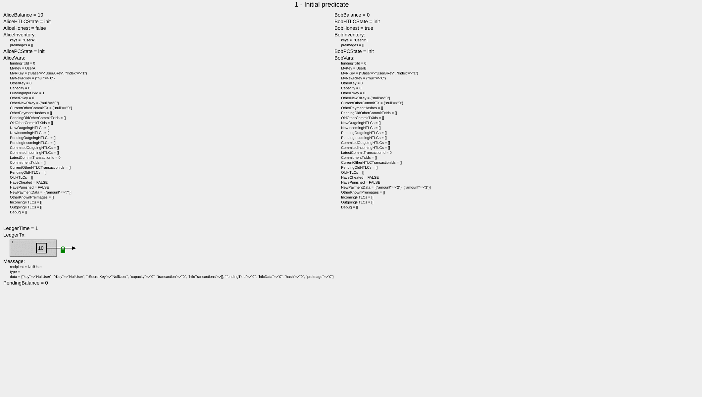

# Visualization of Execution

The following visualization shows each state that leads to a counterexample of a faulty constructed protocol.
The values of internal variables of Alice and Bob are shown as well as the transactions and keys the have stored.
At the bottom, the state of the ledger and the global message variable are shown.
Changes to the previous state are colored red.

